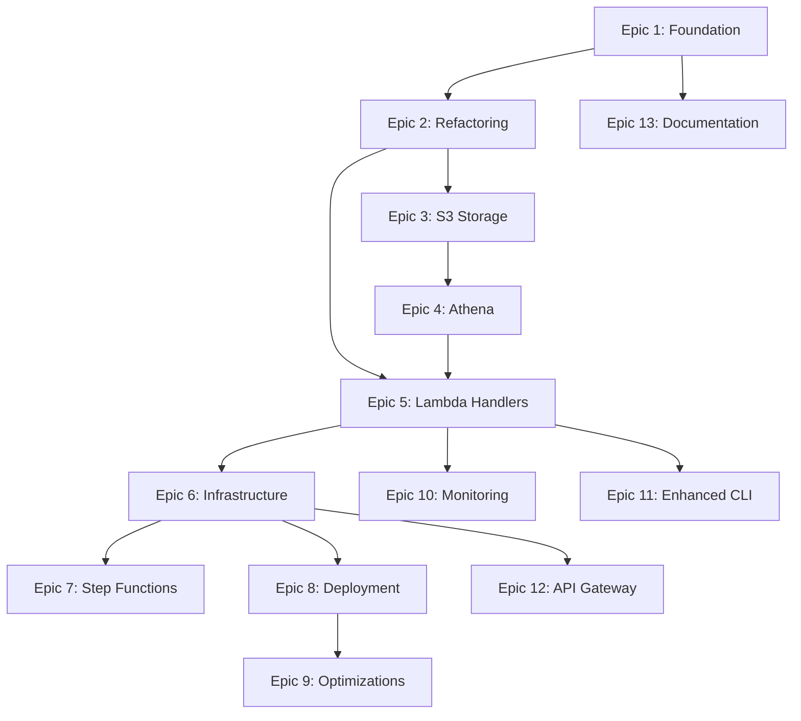

# S3/Athena/Lambda Integration - Implementation Plan

## Overview
This document outlines the complete implementation plan for adding AWS S3 storage, Athena querying, and Lambda deployment capabilities to the Vanta Vulnerability Statistics utility.

## Epic Breakdown

### Epic 1: Foundation & Configuration (3-4 days)
**Goal**: Establish foundational infrastructure and configuration management

**Sub-tasks**:
1. Add AWS dependencies (boto3, pyarrow, pandas, aws-lambda-powertools)
2. Create configuration management system
3. Implement credentials manager for multi-source loading
4. Add environment detection (local vs Lambda)

**Deliverables**:
- Updated requirements.txt and requirements-lambda.txt
- src/config/settings.py - Configuration loader
- src/config/credentials.py - Multi-source credential manager
- config.json template

---

### Epic 2: Code Refactoring for Lambda Compatibility (3-4 days)
**Goal**: Refactor codebase to support both local CLI and Lambda deployment

**Sub-tasks**:
1. Create storage backend abstract base class
2. Refactor VantaAPIClient into src/api/
3. Implement SQLiteStorage backend
4. Refactor VulnerabilityStats into src/processors/
5. Create proper package structure
6. Add unit tests for refactored components

**Deliverables**:
- src/storage/base.py - StorageBackend ABC
- src/api/vanta_client.py - Refactored API client
- src/storage/sqlite_storage.py - SQLite backend
- src/processors/stats_generator.py - Statistics generator
- Proper package structure with __init__.py files
- Unit tests for all components

---

### Epic 3: S3 Storage Implementation (2-3 days)
**Goal**: Implement S3 as a storage backend with Parquet support

**Sub-tasks**:
1. Create S3Storage class implementing StorageBackend
2. Implement data conversion (JSON → Parquet)
3. Add partition management (year/month/day)
4. Implement store_vulnerabilities() for S3
5. Implement store_vulnerability_remediations() for S3
6. Add concurrent upload with retry logic
7. Create migration utility (SQLite → S3)
8. Add integration tests

**Deliverables**:
- src/storage/s3_storage.py - S3 storage backend
- Parquet conversion pipeline
- Partitioning by date (year/month/day)
- scripts/migrate_sqlite_to_s3.py - Migration utility
- Integration tests

**S3 Data Structure**:
```
s3://bucket-name/
├── vulnerabilities/
│   ├── year=2024/month=01/day=15/vulnerabilities.parquet
│   └── current/vulnerabilities_latest.parquet
├── vulnerability_remediations/
│   └── year=2024/month=01/day=15/remediations.parquet
└── raw_json/
    └── backups/sync_20240115_123456.json.gz
```

---

### Epic 4: Athena Query Integration (2-3 days)
**Goal**: Implement AWS Athena integration for querying S3 data

**Sub-tasks**:
1. Create AthenaQueryClient class
2. Implement GlueCatalogManager
3. Create database and table schemas
4. Add partition discovery/management
5. Create query templates (critical vulns, remediation SLA, trends)
6. Implement query result caching
7. Add query execution and result fetching
8. Create Athena integration tests

**Deliverables**:
- src/athena/client.py - Athena query client
- src/athena/catalog_manager.py - Glue catalog manager
- athena_queries/ - Query template directory
- Glue database and table definitions

**Athena Tables**:
- vanta_vulnerabilities
- vanta_vulnerability_remediations
- vanta_vulnerability_history
- vanta_sync_history

---

### Epic 5: Lambda Handler Implementation (3-4 days)
**Goal**: Implement Lambda handlers for serverless execution

**Sub-tasks**:
1. Create sync_handler.py for scheduled syncs
2. Create query_handler.py for API Gateway
3. Create catalog_handler.py for S3 events
4. Implement Lambda Powertools integration
5. Add structured logging
6. Add custom CloudWatch metrics
7. Implement error handling and DLQ
8. Add Lambda function tests

**Deliverables**:
- lambda/handlers/sync_handler.py
- lambda/handlers/query_handler.py
- lambda/handlers/catalog_handler.py
- CloudWatch integration
- Structured logging with correlation IDs
- Lambda tests

**Lambda Functions**:
1. **vanta-sync-function**: EventBridge scheduled daily sync
2. **vanta-query-function**: API Gateway on-demand queries
3. **vanta-catalog-function**: S3 event-triggered partition updates

---

### Epic 6: Infrastructure as Code (2-3 days)
**Goal**: Create IaC templates for all AWS resources

**Sub-tasks**:
1. Create SAM template (template.yaml)
2. Define Lambda functions in SAM
3. Configure S3 buckets and lifecycle policies
4. Define Glue database in SAM
5. Add EventBridge schedule for daily sync
6. Configure IAM roles and policies
7. Create Terraform templates (alternative)
8. Add CloudFormation stack for Athena
9. Create parameter configuration

**Deliverables**:
- infrastructure/sam/template.yaml - SAM template
- infrastructure/terraform/main.tf - Terraform (optional)
- IAM roles and policies
- EventBridge rules
- S3 lifecycle policies

**Resources Created**:
- Lambda Functions (3)
- S3 Bucket with versioning
- Glue Database and Tables
- EventBridge Schedule
- API Gateway (optional)
- CloudWatch Log Groups
- IAM Roles and Policies
- Dead Letter Queue

---

### Epic 7: Step Functions Orchestration (1-2 days) [OPTIONAL]
**Goal**: Implement Step Functions for complex workflow orchestration

**Sub-tasks**:
1. Design state machine workflow
2. Create Step Functions definition JSON
3. Implement parallel branch processing
4. Add error handling states
5. Configure SNS notifications
6. Add to SAM/CloudFormation template
7. Create workflow tests

**Deliverables**:
- lambda/state_machines/sync_workflow.json
- SNS topic for notifications
- State machine tests

**Workflow Steps**:
1. FetchVulnerabilities
2. ProcessAndStore (parallel)
3. UpdateGlueCatalog
4. SendNotification

---

### Epic 8: Deployment Automation (1-2 days)
**Goal**: Create automated deployment scripts and CI/CD

**Sub-tasks**:
1. Create deploy_lambda.sh script
2. Create create_layer.sh for Lambda layers
3. Implement SAM build automation
4. Add GitHub Actions workflow (optional)
5. Create rollback script
6. Add deployment validation tests
7. Create deployment documentation

**Deliverables**:
- scripts/deploy_lambda.sh
- scripts/create_layer.sh
- .github/workflows/deploy.yml (optional)
- Deployment documentation

**Deployment Commands**:
```bash
./scripts/deploy_lambda.sh --environment production
```

---

### Epic 9: Lambda Performance Optimizations (1-2 days)
**Goal**: Optimize Lambda functions for performance and cost

**Sub-tasks**:
1. Implement lazy import for heavy libraries
2. Add connection pooling for AWS services
3. Configure memory/timeout tuning
4. Enable Lambda SnapStart (Python 3.11+)
5. Implement exponential backoff with jitter
6. Configure Dead Letter Queue (DLQ)
7. Add CloudWatch alarms for errors
8. Performance testing and benchmarking

**Deliverables**:
- Optimized Lambda functions
- DLQ configuration
- CloudWatch alarms
- Performance benchmarks

**Optimization Targets**:
- Cold start < 2 seconds
- Memory optimized per function
- Cost reduced by 30-50%

---

### Epic 10: Monitoring & Observability (1-2 days)
**Goal**: Implement comprehensive monitoring and observability

**Sub-tasks**:
1. Implement Lambda Powertools metrics
2. Add structured logging with correlation IDs
3. Enable X-Ray tracing
4. Create CloudWatch dashboard
5. Configure CloudWatch alarms
6. Set up SNS notifications
7. Add cost tracking metrics
8. Create runbook for common issues

**Deliverables**:
- CloudWatch dashboard
- Custom metrics
- X-Ray tracing
- Alarms and notifications
- Operational runbook

**Metrics Tracked**:
- Vulnerabilities synced
- Sync duration
- Query execution time
- Error rates
- Lambda invocation count
- S3 upload size/duration
- Athena query cost

---

### Epic 11: Enhanced CLI for Lambda Management (1-2 days)
**Goal**: Enhance CLI to support Lambda deployment and management

**Sub-tasks**:
1. Add --deploy-lambda command
2. Add --trigger-lambda-sync command
3. Add --lambda-status command
4. Add --lambda-logs command with streaming
5. Add --storage-backend flag (sqlite|s3|hybrid)
6. Update help documentation
7. Add CLI tests
8. Update README with new commands

**Deliverables**:
- Enhanced CLI with Lambda commands
- Updated documentation
- CLI tests

**New CLI Commands**:
```bash
# Deploy to Lambda
python vanta_vuln_stats.py --deploy-lambda

# Trigger Lambda sync
python vanta_vuln_stats.py --trigger-lambda-sync

# Check Lambda status
python vanta_vuln_stats.py --lambda-status

# Stream Lambda logs
python vanta_vuln_stats.py --lambda-logs --follow

# Use S3 storage locally
python vanta_vuln_stats.py --storage-backend s3 --severity CRITICAL
```

---

### Epic 12: API Gateway Integration (2-3 days) [OPTIONAL]
**Goal**: Create REST API for external query access

**Sub-tasks**:
1. Design REST API endpoints
2. Configure API Gateway
3. Implement API Key authentication
4. Add Cognito authentication (optional)
5. Implement rate limiting
6. Add CORS configuration
7. Create API documentation
8. Add API integration tests

**Deliverables**:
- API Gateway configuration
- REST endpoints
- Authentication
- API documentation
- Integration tests

**API Endpoints**:
```
POST /api/v1/query - Execute query
GET /api/v1/sync/status - Get sync status
GET /api/v1/sync/history - Get sync history
POST /api/v1/sync/trigger - Trigger sync
```

---

### Epic 13: Documentation (2-3 days)
**Goal**: Create comprehensive documentation

**Sub-tasks**:
1. Create LOCAL_SETUP.md
2. Create LAMBDA_DEPLOYMENT.md
3. Create S3_ATHENA_GUIDE.md
4. Create API_REFERENCE.md
5. Create MIGRATION.md (SQLite to S3)
6. Create TROUBLESHOOTING.md
7. Update main README.md
8. Add architecture diagrams

**Deliverables**:
- docs/LOCAL_SETUP.md
- docs/LAMBDA_DEPLOYMENT.md
- docs/S3_ATHENA_GUIDE.md
- docs/API_REFERENCE.md
- docs/MIGRATION.md
- docs/TROUBLESHOOTING.md
- Updated README.md
- Architecture diagrams

---

## Total Estimated Effort
- **Core Implementation**: 14-18 days
- **Optional Features** (Step Functions, API Gateway): +3-5 days
- **Total with Optional**: 17-23 days

## Implementation Order

### Phase 1: Foundation (Weeks 1-2)
1. Epic 1: Foundation & Configuration
2. Epic 2: Code Refactoring

### Phase 2: Storage & Queries (Week 3)
3. Epic 3: S3 Storage Implementation
4. Epic 4: Athena Query Integration

### Phase 3: Lambda Deployment (Week 4)
5. Epic 5: Lambda Handler Implementation
6. Epic 6: Infrastructure as Code
7. Epic 8: Deployment Automation

### Phase 4: Optimization & Monitoring (Week 5)
8. Epic 9: Lambda Optimizations
9. Epic 10: Monitoring & Observability
10. Epic 11: Enhanced CLI

### Phase 5: Optional Features & Documentation
11. Epic 7: Step Functions (Optional)
12. Epic 12: API Gateway (Optional)
13. Epic 13: Documentation

## Success Criteria

### Must Have
- [x] Local CLI continues to work with SQLite
- [ ] S3 storage backend functional
- [ ] Athena queries work correctly
- [ ] Lambda sync function deployed and scheduled
- [ ] Data migration from SQLite to S3 successful
- [ ] Documentation complete

### Should Have
- [ ] Lambda query function with API Gateway
- [ ] CloudWatch monitoring and alarms
- [ ] Cost optimization implemented
- [ ] Performance benchmarks documented

### Nice to Have
- [ ] Step Functions orchestration
- [ ] Full REST API with authentication
- [ ] Multi-region support
- [ ] CI/CD pipeline

## Dependencies



## AWS Services Used

1. **S3**: Data storage (Parquet files)
2. **Athena**: Query engine
3. **Glue**: Data catalog
4. **Lambda**: Serverless compute
5. **EventBridge**: Scheduling
6. **API Gateway**: REST API (optional)
7. **Secrets Manager**: Credential storage
8. **CloudWatch**: Logs, metrics, alarms
9. **X-Ray**: Distributed tracing
10. **SNS**: Notifications
11. **SQS**: Dead letter queue
12. **Step Functions**: Orchestration (optional)
13. **IAM**: Access control

## Cost Estimates (Monthly)

Based on daily syncs and moderate querying:

- **S3 Storage**: $5-10 (100GB with Intelligent-Tiering)
- **Lambda**: $5-15 (daily sync + occasional queries)
- **Athena**: $5-20 (depends on query frequency)
- **Glue**: $1 (data catalog)
- **CloudWatch**: $2-5 (logs and metrics)
- **Other**: $2-3 (SNS, SQS, etc.)

**Total**: ~$20-55/month (varies with usage)

**Cost Optimization**:
- Use partition pruning in Athena
- Compress data with Parquet
- Archive old data to Glacier
- Right-size Lambda memory
- Use S3 Intelligent-Tiering

## Risk Mitigation

### Risk 1: Large Dataset Performance
**Mitigation**: Implement streaming, pagination, and chunked uploads

### Risk 2: Lambda Timeout (15 min)
**Mitigation**: Use Step Functions for longer workflows

### Risk 3: Data Migration Issues
**Mitigation**: Implement validation, dry-run mode, and rollback

### Risk 4: Cost Overruns
**Mitigation**: Set up CloudWatch billing alarms, optimize queries

### Risk 5: API Rate Limiting (Vanta)
**Mitigation**: Already handled with exponential backoff

## Next Steps

1. Review and approve this plan
2. Run `scripts/create_github_issues.sh` to create GitHub issues
3. Set up AWS account and initial S3 bucket
4. Start with Epic 1: Foundation & Configuration
5. Iterate through epics in order

## Questions to Address

1. Which AWS region should we use?
2. What should the S3 bucket naming convention be?
3. Do we need multi-region support?
4. What's the retention policy for old data?
5. Do we need the optional API Gateway feature?
6. Should we implement Step Functions initially or later?
7. What's the alerting/notification preference (email, Slack, etc.)?

## References

- [AWS Lambda Documentation](https://docs.aws.amazon.com/lambda/)
- [AWS Athena Documentation](https://docs.aws.amazon.com/athena/)
- [AWS SAM Documentation](https://docs.aws.amazon.com/serverless-application-model/)
- [Apache Parquet Format](https://parquet.apache.org/)
- [AWS Lambda Powertools Python](https://docs.powertools.aws.dev/lambda/python/)
