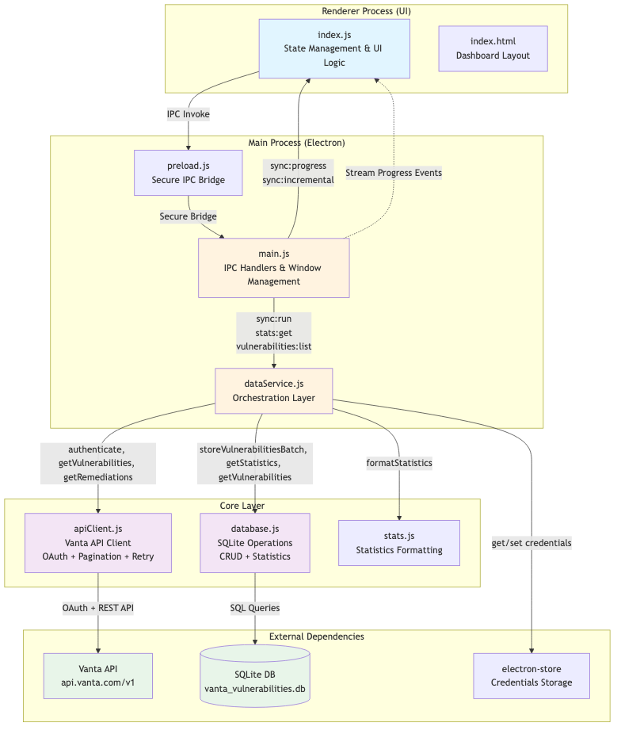

# Vanta Vulnerability Dashboard (Electron)

An Electron desktop application for synchronizing vulnerability data from the Vanta API, storing it locally in SQLite, and exploring rich statistics without leaving your workstation.

The app replaces the legacy Python CLI/Qt tooling with a modern JavaScript stack focused on a streamlined analyst workflow. Credentials are stored securely using [`electron-store`](https://github.com/sindresorhus/electron-store) and the synchronized dataset lives in the Electron user data directory so it can be backed up or inspected independently.

## Features

- **One-click data sync** – authenticate with a Vanta API client (client credentials flow) and fetch the complete vulnerability and remediation datasets with rate limiting safeguards and automatic retries.
- **Local SQLite cache** – data is saved in `better-sqlite3`, preserving raw payloads while surfacing the most relevant metadata for filtering and statistics.
- **Rich dashboard** – interactive metrics for totals, severity distribution, integration coverage, fixability, asset and CVE uniqueness, and CVSS averages.
- **Vulnerability explorer** – filter by severity, status, fixability, integration, asset ID, CVE/name, and discovery/remediation date ranges. Paginated results keep navigation fast even for large datasets.
- **Detail inspection** – view the full JSON payload for any vulnerability alongside its remediation history for audit or debugging purposes.
- **Asset correlation** – automatically sync asset metadata from the Vanta Assets API so explorer views show friendly asset names, owners, environments, and last-seen timestamps alongside raw IDs.
- **Sync history** – track how many records were inserted, updated, or newly remediated on each synchronization.

## Getting Started

### Prerequisites

- [Node.js](https://nodejs.org/) 18 or later (LTS recommended).
- macOS, Windows, or Linux desktop environment.
- A Vanta API client (client ID and client secret) with the `vanta-api.all:read` scope.

### Installation

1. Install dependencies (this will also rebuild native modules for the bundled Electron runtime):

   ```bash
   npm install
   ```

   If you ever encounter native module version errors (for example with `better-sqlite3`) you can manually rerun the rebuild step:

   ```bash
   npm run postinstall
   ```

2. Launch the Electron application in development mode:

   ```bash
   npm start
   ```

   The application window will open automatically. You can reload with <kbd>Cmd/Ctrl</kbd>+<kbd>R</kbd> during development. To open dev tools, set the environment variable `ELECTRON_START_URL=1` before running `npm start`.

### Building Distribution Packages

Electron Builder is pre-configured for packaging. Run one of the following commands depending on your needs:

- Generate unpacked binaries (`dist/` directory):

  ```bash
  npm run pack
  ```

- Produce installable artifacts (DMG/EXE/AppImage depending on platform):

  ```bash
  npm run dist
  ```

#### Creating a macOS `.app` bundle

To generate the macOS application bundle (`Vanta Vulnerability Stats.app`) run the dedicated packaging script on a macOS host:

```bash
npm run package:mac
```

This command emits the unsigned `.app` bundle to `dist/mac/`. Because Electron Builder cannot cross-compile macOS applications from Windows or Linux, the script must be executed on macOS (you can still run `npm install` on other platforms beforehand). If you need to notarize or code-sign the build, supply the appropriate environment variables documented in the [Electron Builder macOS guide](https://www.electron.build/code-signing#macos). Refer to the broader [Electron Builder documentation](https://www.electron.build/) for customizing icons, signing, and advanced packaging options.

## Application Architecture

### Directory Structure

```
src/
├── core/
│   ├── apiClient.js       # Axios-based Vanta API client with pagination + retry
│   ├── database.js        # SQLite data model and statistics helpers
│   └── stats.js           # Renderer-friendly statistics formatting utilities
├── main/
│   ├── main.js            # Electron bootstrap & IPC wiring
│   ├── preload.js         # Secure bridge between renderer and main process
│   └── dataService.js     # Orchestrates sync, storage, and settings
└── renderer/
    ├── index.html         # Dashboard layout
    ├── index.js           # UI logic, state management, and IPC calls
    └── styles.css         # Aurora-inspired styling
```

### Architecture Diagram

The application follows a layered architecture with clear separation between the UI (renderer), orchestration (main process), and data/API layers (core):



#### Data Flow for Sync Operation

1. **User Initiates Sync**: UI calls `sync:run` via IPC
2. **Authentication**: DataService retrieves credentials from electron-store and passes to ApiClient
3. **API Requests**: ApiClient authenticates with Vanta OAuth, then paginates through vulnerabilities and remediations endpoints
4. **Batch Processing**: ApiClient fetches data in batches (max 100 per page) with automatic retry on rate limits
5. **Database Storage**: DataService buffers records (1000 at a time) then flushes to Database using transactions
6. **Progress Updates**: DataService streams progress events back to UI via IPC (`sync:progress`, `sync:incremental`)
7. **Statistics**: After sync completes, UI can query statistics which are calculated by Database and formatted by Stats

#### Key Design Patterns

- **IPC Security**: All renderer-to-main communication goes through a hardened preload script (no Node.js access in renderer)
- **Batch Processing**: API responses and database writes are batched to optimize performance and reduce memory pressure
- **Event Streaming**: Progress updates are streamed in real-time to keep the UI responsive during long syncs
- **Transaction Safety**: All database writes use SQLite transactions to ensure atomicity
- **Retry Logic**: API client implements exponential backoff for rate limits (429) and server errors (5xx)
- **Credential Isolation**: Sensitive credentials stored via electron-store, never exposed to renderer process

## Configuration & Storage

- **Credentials** – stored via `electron-store` in the OS-specific user data directory (`app.getPath('userData')`). Values are persisted across launches.
- **Database** – created at `<userData>/storage/vanta_vulnerabilities.db`. All vulnerability and remediation payloads are saved as JSON for downstream analysis.
- **Sync telemetry** – each synchronization logs totals, new records, updates, and newly remediated items in the `sync_history` table.

To reset the application state, delete the storage directory shown at the bottom of the dashboard or clear it manually from the file system.

## Development Notes

- The Vanta API base URLs are baked into `src/core/apiClient.js`. If Vanta introduces API version changes, update the constants in that module.
- The UI intentionally avoids heavy frameworks to keep bundle size minimal. If you prefer React/Vue/etc., use the existing IPC layer and database modules as a starting point.
- `better-sqlite3` is bundled for synchronous, transaction-friendly SQLite access. For extremely large datasets consider streaming inserts or chunked persistence in `dataService.syncData`.

## Troubleshooting

| Symptom | Possible Cause | Resolution |
| --- | --- | --- |
| Authentication errors | Invalid client credentials or missing `vanta-api.all:read` scope | Double-check the API client configuration in Vanta. |
| Sync stalls with rate-limit messages | Vanta throttling requests | The client automatically retries with exponential backoff. Wait for completion or reduce sync frequency. |
| Empty dashboard after sync | No vulnerabilities returned by API or filters too restrictive | Relax filters or inspect raw data via the detail pane. |
| Database locked errors | External tools opening the SQLite file concurrently | Close other tools or copy the database before inspecting externally. |

## License

This project continues to be distributed under the MIT License. See [LICENSE](LICENSE) for details.
